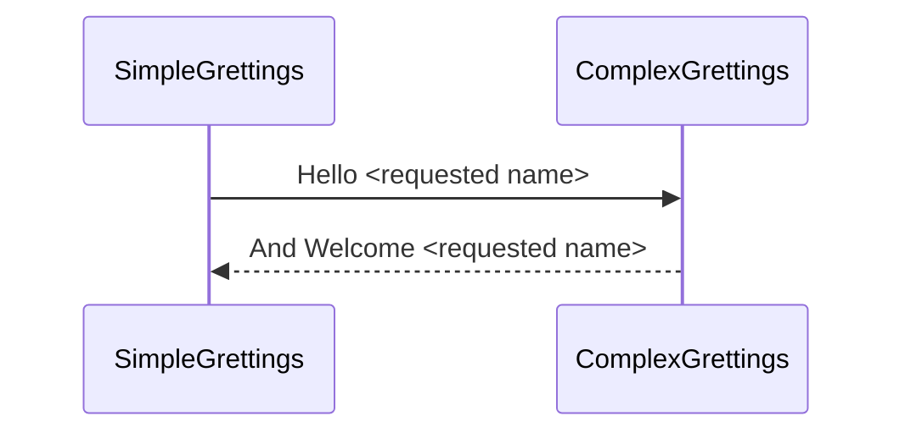

# Opentracing demo.

The main goal is to understand how to works opentracing with a couple of simple Spark core microservices.

## Simple Flow

And this will produce a flow chart:

# opentracing_spark
