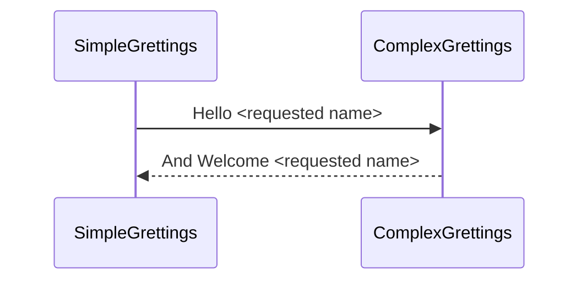

# OpenTracing demo and training.

The main goal is to understand how to works OpenTracing with a couple of simple Spark core microservices.

## Simple Flow

# Things that you need

## Install artifacts from parent project as follow :
> mvn clean install

## You need to do the request.

For example:
> curl http://localhost:8080/hello/Arya

## Docker, of course

For this training I'm using jaeger, but you have more options: http://opentracing.io/documentation/pages/supported-tracers

> docker run -d -p 5775:5775/udp -p 16686:16686 jaegertracing/all-in-one:latest

You can open http://localhost:16686/ and see the simple traces in Jaeger UI.