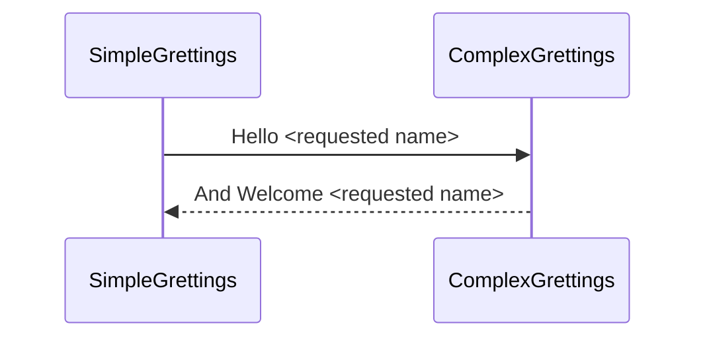

# OpenTracing demo.

The main goal is to understand how to works OpenTracing with a couple of simple Spark core microservices.

## Simple Flow

```mermaid
sequenceDiagram
SimpleGrettings ->> ComplexGrettings: Hello <requested name>
ComplexGrettings-->>SimpleGrettings: And Welcome <requested name>
```

